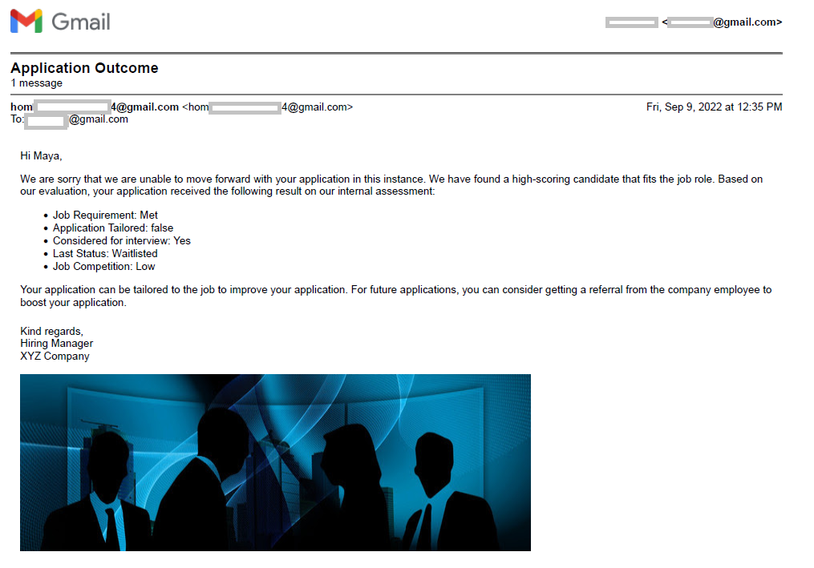

# Automated Job Application Handler
Hiring a suitable candidate for a role is a lengthy and cumbersome process. This automated job application handler will reduce the waiting time for candidates and selection time for recruitment teams. Features such as automatic refusal and automatic scoring by the engine based on the profile and business rules will speed up the hiring process. This system can be used as a guide to filter applicants and start the hiring process or it can be used side-by-side in the actual recruitment process. The only change is random score should be replaced by the interview score. The automatic feedback provided to the applicants according to their application makes the hiring process fair and saves hiring teams’ time. 

## Workflow
The workflow of the application handler is depicted by the following steps:
1) Applicants enter their information, select a job, send it to the recruiter and wait for the outcome.
2) The recruitment system stores the application and waits till the job deadline before proceeding to the screening stage.
3) The screener will reject those applications that do not meet the job requirements.
4) The applications passing the screening stage will be either fast-tracked or waitlisted by the recruiter based on other standards set by the recruitment team.
5) The interviewed candidates will be scored and compared.
6) The top-ranked candidate will then have to pass the threshold test, and the barrier is directly proportional to the number of valid applications received for the job.
5) Passing the barrier will result in the vacancy being fulfilled. If the job is fulfilled by one of the fast-tracked candidates, all waiting candidates will be notified of the outcome.
6) If fast-tracked candidates fail to fill up the role, waitlisted candidates will be called for an interview, and the process continues until the role is fulfilled or there are no more candidates on the waiting list.
7) Finally, all candidates, successful and unsuccessful, will be emailed about the application outcome.

## Sample Email
This is a sample email generated for applicants who could not make it past the waiting stage. For more variations of generated email, check the images folder.



## Additional Information
This project is developed using Camunda, Java and FreeMarker. The developed project is deployed to the shared Tomcat engine. Also, to enable the email feature, the credentials in the mail-config.properties file should be replaced with valid credentials.

```
# send mails via SMTP
mail.transport.protocol=smtp

mail.smtp.host=smtp.gmail.com
mail.smtp.port=465
mail.smtp.auth=true
mail.smtp.ssl.enable=true
mail.smtp.socketFactory.port=465
mail.smtp.socketFactory.class=javax.net.ssl.SSLSocketFactory

# poll mails via IMAPS
mail.store.protocol=imaps

mail.imaps.host=imap.gmail.com
mail.imaps.port=993
mail.imaps.timeout=10000

# if peek = false then the polled mails are marked as read
mail.imaps.peek=false

# additional config
mail.poll.folder=INBOX
mail.sender=USER@google.com
mail.sender.alias=User Inc

mail.attachment.download=true
mail.attachment.path=attachments

# credentials
mail.user=USER@gmail.com
mail.password=PASSWORD
```

To learn more about using the email feature, check out [this GitHub page](https://github.com/camunda-community-hub/camunda-platform-7-mail).
Also, you need to set the `MAIL_CONFIG` environment variable to the path where you copied the configuration file. Check [this page](https://github.com/camunda-community-hub/camunda-platform-7-mail/tree/master/examples/pizza) for setting up the `MAIL_CONFIG` environment variable correctly.

To enable your Gmail to send emails, follow the instructions starting from step 3 on [this page](https://mkyong.com/java/javamail-api-sending-email-via-gmail-smtp-example/).

For retrieval and storage purposes, a connection to a database is needed. In this project, MySQL database has been used. After setting up the database, we need to have five tables set up in the database. Run the following queries to create the tables.

### Job Application Table
This table stores all applications received for the job.

```
Create Table job_application (
Id varchar(5) primary key, Job_id varchar(5),
Name varchar(20), Status varchar(30),
Requirement_met varchar(5),
Has_referral varchar(5),
Tailored_application varchar(5), Referee_id varchar(5), Email varchar(50) Not null,
foreign key (referee_id) references referee(id));
```

### Fasttracked Job Application Table
This table stores the applications that are selected for an interview and gets reset when a new pool of candidates enters the interview stage.
```
Create Table fasttracked_job_application (
Id varchar(5) primary key, Job_id varchar(5),
Name varchar(20),
Has_referral varchar(5),
Tailored_application varchar(5), score DOUBLE(11,8));
```

### Waitlisted Job Application Table
This table stores the waitlisted applications and gets updated when waitlisted candidates are called for an interview.
```
Create Table waitlisted_job_application (
Id varchar(5) primary key, Job_id varchar(5),
Name varchar(20),
Has_referral varchar(5),
Tailored_application varchar(5));
```

### Referee Table
This table stores the information about the referee names and acts as a foreign table for the job application table.
```
Create Table referee (
Id varchar(5) primary key,
Name varchar(20));
```

Populate the table with the following information.
```
Insert Into referee (Id, Name) Values
("1", "Ram Das"),
("2", "John Cena"),
("3", "Nazim Hussain");
```

### Outcome Table
This table stores the outcome of the job application for each applicant.
```
CREATE TABLE outcome (
    Id int NOT NULL AUTO_INCREMENT,
    Job_id varchar(5) NOT NULL,
    Name varchar(20), Status varchar(30),
    Has_referral varchar(5), Tailored_application varchar(5),
    Waitlisted varchar(20) Default "Not Applicable",
    Competition varchar(20), Outcome varchar(20), Reason varchar(50),
    PRIMARY KEY (Id)
); 
```
